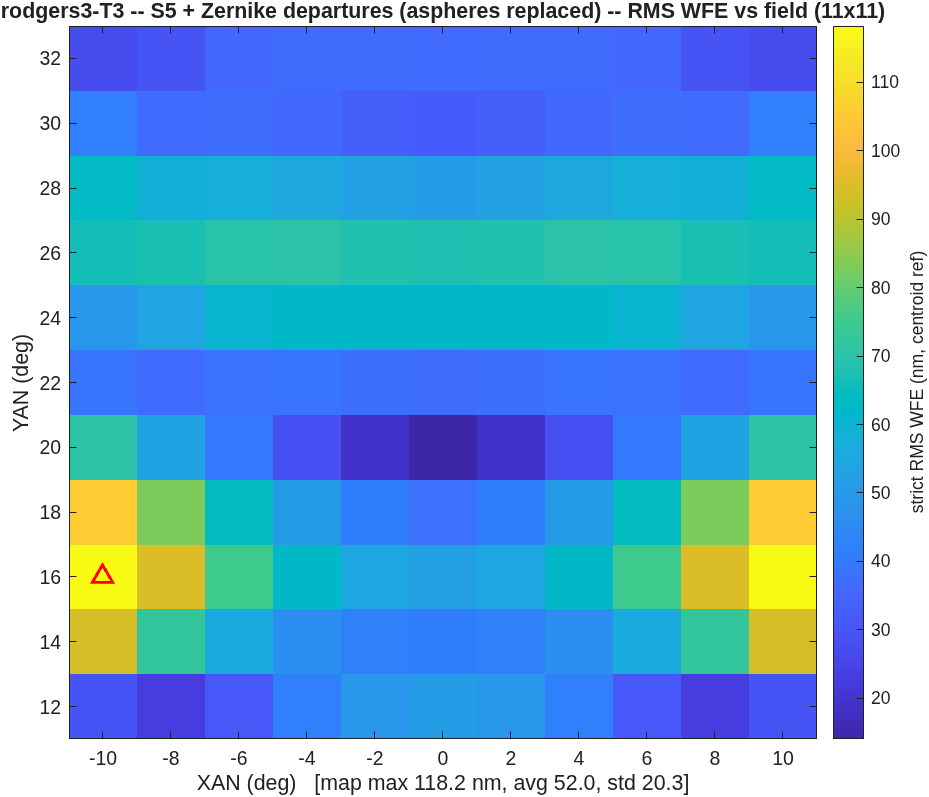
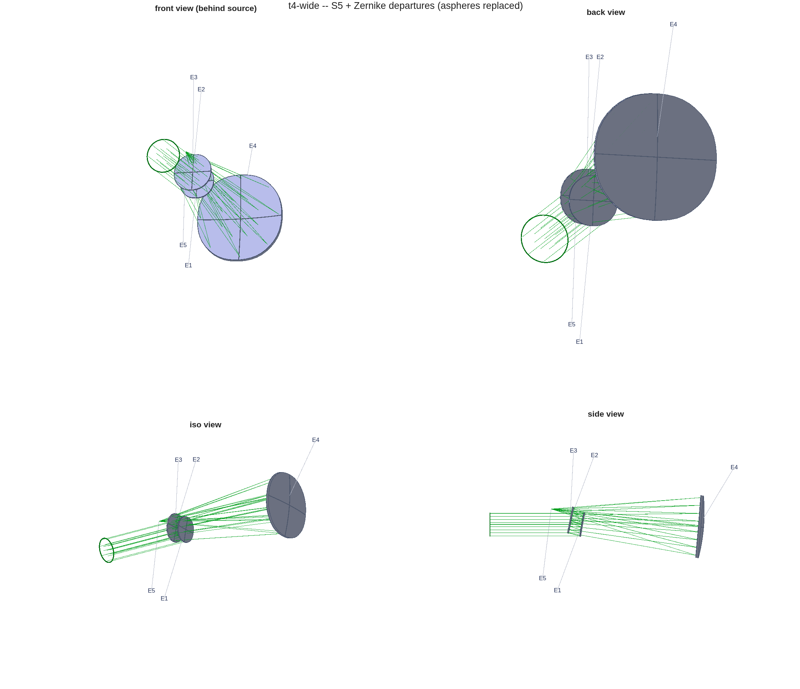

<!-- rodgers3 story deck.  GENERATED by deck_rodgers3.py --
     edit the generator, not this file.  Build: python3 deck_rodgers3.py -->

# The Offset-Field Imager, Reproduced and Re-Designed
MACOS design layer vs CODE V on a 22°-offset wide-field three-mirror imager
D. C. Redding with Claude Code — 20 August 2026.  Source study: M. Rodgers, 260802-WFOVimager_Offsetfield (CODE V) + five lens sequences (committed).  Reproduction: MACOS_resources mmacos/challenges/rodgers3 + templates/10_telescopes/offset_imager, with packet.
~ Every WFE number in this deck: strict RMS WFE, centroid reference on the stage's frozen focal plane, exit-pupil anchor, piston-only removal; quoted statistic = dense 11x11 map MAXIMUM over the field box — the statistic the source slides quote (decoded on slide 2).  DRAFT — pending sign-off.

## 1 — The challenge | A 20°x20° field box moved 22° off axis, an exit-beam pointing constraint, and hard clearances
::: left
- The system, from the lens sequences: three-mirror imager, EPD 75 mm, F/4 (EFL 300 mm), λ = 1 µm, field box 20°x20° full width centred at YAN +22°.  Constraints: exit beam horizontal (rung 2 on); beam/mirror clearances > 50 mm and > 35 mm (rung 4 on).  Optimization field: 9 points, XAN ±10°.
- The source study climbs the five-rung ladder in the table — each rung one added freedom, each closed by a reported WFE.
- The decoded statistic (Stage 0): each reported "RMS WFE ≤ x" equals the MAXIMUM of CODE V's dense RMS-vs-field map over the full box — established from the slides' own embedded plot metadata, not assumed.

| rung | design state | reported nm |
| r1 | coaxial, on-axis box, aspheres | 159 |
| r2 | same mirrors, offset box, FPA refit | 8810 |
| r3 | re-asphered at the offset | 168 |
| r4 | + tilt/decenter + radii | 117 |
| r5 | + 8th-order Zernike + radii | 53 |
::: right
{h=4.6}
~ Reported nm values are quoted from the source slides; their statistic — the dense-map maximum — is decoded and gated on slide 2.

## 2 — Stage 0: earn the right to compare | All five reported rungs reproduce from the lens sequences inside [0.8, 1.25]x — nothing tuned toward them
::: left
| rung | reported nm | reproduced map max | ratio | verdict |
| r1 | 159 | 157.74 | 0.992 | PASS |
| r2 | 8810 | 9664.11 | 1.097 | PASS |
| r3 | 168 | 166.32 | 0.990 | PASS |
| r4 | 117 | 124.29 | 1.062 | PASS |
| r5 | 53 | 54.66 | 1.031 | PASS |
- The gates run in the committed regression suite (tRodgers3, coarsened 5x5 maps), so the reproduction cannot silently rot.
::: right
- Conventions decoded to get there, each pinned by its own test: aspheric-coefficient sign and units; the Zernike set is Born&Wolf with a one-term index offset (negative control: dropping the offset misses rung 5 by 2989x); decenters verbatim with the tilt sense flipped; native stop aiming confirmed by A/B to 0.04 nm.
- The reproduction is the licence for every comparison that follows: same metric, same statistic, same field sampling on both sides.
::: full
~ strict RMS WFE, centroid reference on the stage's frozen focal plane, exit-pupil anchor, piston-only removal; quoted statistic = dense 11x11 map MAXIMUM over the field box.  Known bounded approximation: the uniform pupil bundle vs CODE V's stop-gridded rays inflates the r2/r4 maps and the map minima slightly (full list: r3_s0_report.txt).

## 3 — The template | offset_imager: one parameterized flow — five stages, first-order identities re-derived at every iterate
::: left
::: stack
- S1 · coaxial solve :: first-order seed (EFL = EPD x F#, Petzval = 0), then conics + aspheres at the on-axis box
- S2 · the move :: the same mirrors at the offset box; only the focal plane follows
- S3 · re-solve at the used field :: symmetric surfaces re-solved at the offset, from the better of two starts
- S4 · tilt/decenter under constraints :: exit direction + clearances enter the solve as residual rows
- S5 · Zernike departures :: aspheres replaced; power pinned to the radii, tilt to the pointing
::: right
- Identities are enforced by construction, not penalized: EFL exact at every iterate; Petzval zero in the symmetric stages; stop pose re-derived; focal plane re-posed per stage.
- The solver is damped Gauss–Newton on per-ray strict-WFE residuals over a 3x3 solve grid; every reported number is scored on the dense map (solve set != scoring set).
- One call runs the whole story — ladder, counter-designs, report: oi_story(params).  The challenge instance and a second instrument (slide 8) are the same code at different parameters.
~ Template: templates/10_telescopes/offset_imager (committed, with per-stage reports and decks).

## 4 — Stages 1–3: solve, move, re-solve | Depth bought on axis is paid back at the offset; re-solving at the used field recovers 1205x
::: left
- S1, on-axis box: 37.8 nm map max (reported rung 1: 159).  The solve runs 4x deeper than the source rung — 13.5 µm to 23.7 nm qmean in 7 iterations.
- S2, the same mirrors at 22°: 303,586 nm — 34x the reported 8810.  The deeper on-axis optimum pays proportionally more off axis: this rung measures the S1 design as much as the offset.
- S3, re-solved at the used field: 252.0 nm (reported: 168, ratio 1.50).  The fresh Petzval-flat sphere seed (25.6 µm start) beats the carried on-axis aspheres as the starting point; the conics migrate to the oblate class (K1 -2.42 to 1.44).
::: right
{h=2.62}
{h=2.62}
~ strict RMS WFE, centroid reference on the stage's frozen focal plane, exit-pupil anchor, piston-only removal; quoted statistic = dense 11x11 map MAXIMUM over the field box.  S1–S3 run unconstrained; their clearance floors (3 / 27 / 13 mm) are reported for context only.

## 5 — Stage 4, the buildability rung | Paying the same clearance constraint lands the same number: 113.6 nm at 34.1 mm vs the reported 117 at ≥ 35 — 0.97x
::: left
- Unconstrained, tilt/decenter reach 58.3 nm — with the M3-to-focal-plane beam through M2's patch (clearance floor 0.0 mm).  Not buildable.
- The clearance model: nine beam-leg/obstacle pairs, per-field footprint disks over the box centre and YAN extremes, the focal plane counted as an obstacle.  The same model the solve pays as hinge residual rows and the report gates.
- Two toolchains, same constraint, same answer to 3% — strong evidence both are measuring the same design space — and a clean measurement of what the clearance constraint costs: 1.9x in WFE at this rung (58.3 to 113.6 nm).
- Exit chief within 0.03° of horizontal at every stage (the pin, solved as an equality row).
::: right
{h=2.62}
{h=2.62}
~ strict RMS WFE, centroid reference on the stage's frozen focal plane, exit-pupil anchor, piston-only removal; quoted statistic = dense 11x11 map MAXIMUM over the field box.

## 6 — Stage 5, the honest rung | 118.2 nm vs the reported 53 — a solver-budget gap, not physics
::: left
- Adding the Zernike basis (the source study's own varied term set, 82 variables) under the clearance rows moves the ladder 113.6 to 118.2 nm: the stage stalls at its S4 level.  The min-rule branch value is 113.6.
- The budget: a 3x3 solve grid and a 30-iteration cap against 82 variables plus the constraint rows.  The stage is convergence-limited — the gap to the reported 53 (2.2x) is solver budget, not convention, and one long-budget run is the named follow-on.
- The term set is not the limit — slide 7, counter (b).
::: right
{h=3.6}
~ strict RMS WFE, centroid reference on the stage's frozen focal plane, exit-pupil anchor, piston-only removal; quoted statistic = dense 11x11 map MAXIMUM over the field box.

## 7 — Counter-designs, same constraints, same budget | The sphere+Zernike start wins 1.6x; releasing the pinned terms chokes the solve
::: left
- (a) Sphere + Zernike from the start — S3's radii, conics zeroed, no aspheres, straight to the Zernike solve: 73.1 nm map max, against the heritage path's 118.2 under identical constraint rows and iteration budget.  The asphere heritage is a burden, not a head start.  The unconstrained variant of this branch (27.9 nm) does not survive buildability.
- (b) Power and y-tilt released into the Zernike basis from the S4 design: 1372.9 nm — far worse than the pinned set.  The freed modes fight the jobs the pins already do (power held by the radii, tilt by the pointing); 88 variables against 9 solve fields plus constraint rows.  No evidence the reported 53 nm is term-set-limited — and affirmative evidence for the pinning doctrine at finite solver budget.
::: right
{h=2.62}
{h=2.62}
~ strict RMS WFE, centroid reference on the stage's frozen focal plane, exit-pupil anchor, piston-only removal; quoted statistic = dense 11x11 map MAXIMUM over the field box.

## 8 — The same template on a second instrument | EPD 200 mm, F/2.5, 10°x10° at 12°, its own 10/5 mm clearance spec: every stage gates
::: left
| stage | map max (nm) | clearance (mm) |
| S1 | 30.0 | 9.5 |
| S2 | 942.1 | 9.7 |
| S3 | 173.6 | 9.8 |
| S4 | 81.9 | 6.8 |
| S5 | 40.5 | 7.9 |
- What carried: per-ray Gauss–Newton residuals (per-field-RMS residuals stall); first-order identities re-derived, never penalized; stop decenter as the exit-aiming variable; clearances as hinge rows in the solve; negative controls with teeth at every decode.
- What taught: clearance judged at the box centre misses edge-field blockage — evaluate over the field; a boolean constraint wall freezes a non-compliant start (hinge rows do not); stations are not spacings — a transcription slip briefly suggested F/4.95, and the runner now reads packaging from the .seq truth file so the comparison cannot drift that way again.
::: right
{h=3.5}
~ strict RMS WFE, centroid reference on the stage's frozen focal plane, exit-pupil anchor, piston-only removal; quoted statistic = dense 11x11 map MAXIMUM over the field box (this instrument's box).  Reproduce: rodgers3() — the Stage-0 gates; oi_story(...) — ladder + counters + this deck's numbers; suites tRodgers3 + tOffsetImager.  Written record: challenges/rodgers3/PACKET.md.
