<!-- rodgers3 RE-WALK deck (deck 2).  GENERATED by
     deck_rodgers3_walk.py -- edit the generator, not this file. -->

# Re-Walking the Offset-Field Imager
A workbook: from the committed truth files to the gated ladder
D. C. Redding with Claude Code — 22 August 2026.  Companion to the story deck (deck_rodgers3); source study M. Rodgers, 260802-WFOVimager_Offsetfield.  Everything quoted here is parsed from the committed records of MACOS_resources mmacos/challenges/rodgers3 + templates/10_telescopes/offset_imager.
~ THE METRIC CONTRACT, once for the whole deck: strict RMS WFE, centroid reference on the stage's frozen focal plane, exit-pupil anchor, piston-only removal; quoted statistic = dense 11x11 map MAXIMUM over the field box.  Every WFE number on every slide inherits it.  Workbook genre: 17 content slides in six sections (budget deviation declared, DECK2_PLAN.md).  DRAFT — pending sign-off.

## A1 — The problem, and everything needed is committed | Three mirrors, a 20°x20° box at 22°, an exit pin, hard clearances — and five reported rungs to meet
::: left
- The system: EPD 75 mm, F/4 (EFL 300 mm), λ = 1 µm, field box 20°x20° full width at YAN +22°; exit beam horizontal (rung 2 on); clearances > 50 / > 35 mm (rung 4 on); 9-point optimization field, XAN ±10°.
- The reproduction inputs are IN the repo: five CODE V lens sequences (the truth), the machine-generated reader (rodgers3_seq), the template, the tests, and the packet.  The source presentation is referenced, not committed — nothing below depends on it.

| rung | design state | reported nm |
| r1 | coaxial, on-axis box, aspheres | 159 |
| r2 | same mirrors, offset box, FPA refit | 8810 |
| r3 | re-asphered at the offset | 168 |
| r4 | + tilt/decenter + radii | 117 |
| r5 | + 8th-order Zernike + radii | 53 |
::: right
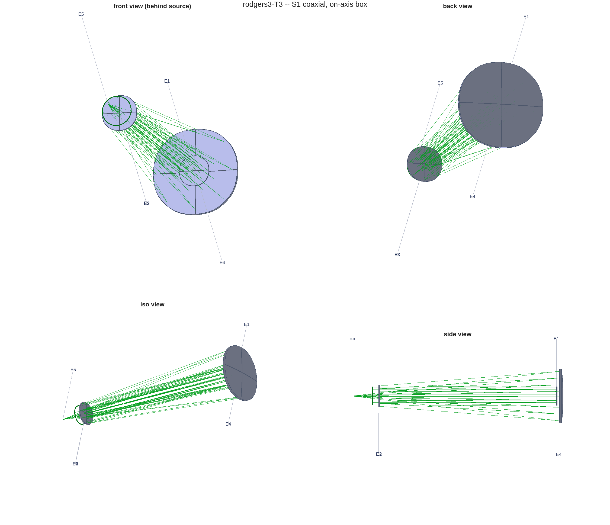{h=4.4}
~ Repo map: challenges/rodgers3/ (decks *.seq -> rodgers3_seq.m, rodgers3.m, run_t3.m, run_s5_budget.m, run_s5_signed.m, PACKET.md) + templates/10_telescopes/offset_imager/ (the template) + design/src (oi_score, oi_clear) + tests (tRodgers3, tOffsetImager).

## A2 — Read the truth, decode the conventions, gate the decode | Five conventions had to be established — each carries its own falsifier
::: left
| convention | decode | its gate |
| focal ratio | thicknesses, NOT stations: th4 −722.9 / th6 +740.8 mm -> F/4.00004 | stations misread gives F/4.95 — retracted in place; runner reads the .seq at runtime |
| the reported statistic | MAX of the dense RMS-vs-field map (from the slides' own embedded plot metadata) | five rungs reproduce in [0.8, 1.25]x |
| Zernike basis | BornWolf, mode = C-index MINUS ONE | dropping the offset misses rung 5 by 2989x |
| tilt/decenter | decenters verbatim, tilt sense flipped | origin discriminant + map-shape check |
| stop aiming | native ChiefRayAiming at the stop Reference | A/B vs Newton aiming: ≤ 0.04 nm |
::: right
| rung | reported nm | reproduced | ratio | verdict |
| r1 | 159 | 157.74 | 0.992 | PASS |
| r2 | 8810 | 9664.11 | 1.097 | PASS |
| r3 | 168 | 166.32 | 0.990 | PASS |
| r4 | 117 | 124.29 | 1.062 | PASS |
| r5 | 53 | 54.66 | 1.031 | PASS |
- The reproduction is the licence for every comparison after it: same metric, same statistic, same sampling, both sides.  Nothing was tuned toward the reported values — the band IS the measurement.
::: full
~ Claim of this slide: decode conventions, then GATE the decode with a falsifier that has teeth.  A convention without its negative control is a guess (r3_s0_report.txt carries the full caveat list).

## B3 — The template | Five stages; first-order identities are re-derived every iterate, never penalized
::: left
::: stack
- S1 · coaxial solve :: first-order seed (EFL = EPD x F#, Petzval = 0), then conics + aspheres at the on-axis box
- S2 · the move :: the same mirrors at the offset box; only the focal plane follows
- S3 · re-solve at the used field :: symmetric surfaces re-solved at the offset, from the better of two starts
- S4 · tilt/decenter under constraints :: exit direction + clearances enter the solve as residual rows
- S5 · Zernike departures :: aspheres replaced; power pinned to the radii, tilt to the pointing
::: right
- Identities enforced by construction: EFL exact at every iterate; Petzval zero in the symmetric stages; the stop pose re-derived (and BOUNDED — a degenerate pupil construction falls back to the pose that traced); the focal plane re-posed per stage.
- Pinning doctrine: power belongs to the radii, tilt to the pointing — freeing them into the figure basis makes the solve fight its own pins (slide D12, counter b).
- One call runs the whole story: oi_story(params) = ladder + counters + report.  The challenge instance is run_t3.m — a thin wrapper that reads the .seq truth at runtime.
~ Template: templates/10_telescopes/offset_imager.  Every stage emits its deck (.in), figures, and a REPORT section — the records this deck is parsed from.

## B4 — The solver | Per-ray residuals with vertex-radial scales; the solve set must be sized to the variables
::: left
- Residuals are PER-RAY wavefront errors stacked over the solve fields — per-field RMS residuals stall: the scalar hides the gradient direction, and the table's S1 row is what per-ray recovers.
- Natural scales are VERTEX-RADIAL: aspheres and Zernike-lMon terms are r^n about the vertex, so an offset beam's lever arm is |footprint centre| + its radius.  Footprint-centred radii under-scale r^8 by orders of magnitude and finite-difference steps then destroy the surface.
- Damped Gauss–Newton with a chord (one Jacobian reused up to 3 accepted steps), trust-radius damping, and a plateau stop (< 0.1%/iteration after warm-up).
- SIZE THE SOLVE SET TO THE VARIABLES: 9 fields against 82 Zernike variables under-determines the solve — the solve set converges while the dense map stalls (measured on slide C11; 25 fields resolve it).  The dense map is always the score; the solve set is only what the optimizer sees.
::: right
| stage | vars | fields | start -> qmean (nm) | iters |
| S1 | 15 | 9 | 13462 -> 23.7 | 7 |
| S3 | 16 | 9 | 25619 -> 140.4 | 30 |
| S4 | 23 | 9 | 140 -> 70.7 | 30 |
| S5 | 83 | 9 | 2150 -> 35.0 | 30 |
- Reading the table: S5's 83 variables against 9 fields is the under-determined row — its dense-map stall and the fix are slide C11.
~ Solver: oi_solve (template dir).  The qmean column is over the SOLVE set; headline numbers are always the dense map.

## B5 — Constraints are rows, and drawings are gates | A wall freezes; a hinge pays; a pierced hinge must go NEGATIVE
::: left
- The exit-beam pin is an EQUALITY row (weighted residual), not a wall: a boolean wall freezes any stage that STARTS outside tolerance — the base Jacobian becomes all wall rows and no step can be evaluated.
- Clearances: nine ordered beam-leg/obstacle pairs, per-field glass patches (footprint disks x1.15, or 1.15-scaled convex hulls), the FP counted as an obstacle, evaluated over the field box — the centre field alone misses edge-field blockage.  The SAME model is the solve's hinge rows and the report's gate.
- The measure must test PIERCING exactly and return MINUS the penetration depth inside the glass.  Both halves were learned the hard way: a 25-sample walk reported millimetres of clearance for beams THROUGH a mirror, and a zero-at-contact measure gives the optimizer no slope to climb out — the solve re-converges on the blocked design.
- The defect was caught by READING THE LAYOUT FIGURE against the gate, not by any number.  Hardware drawings are gates, not illustrations.
::: right
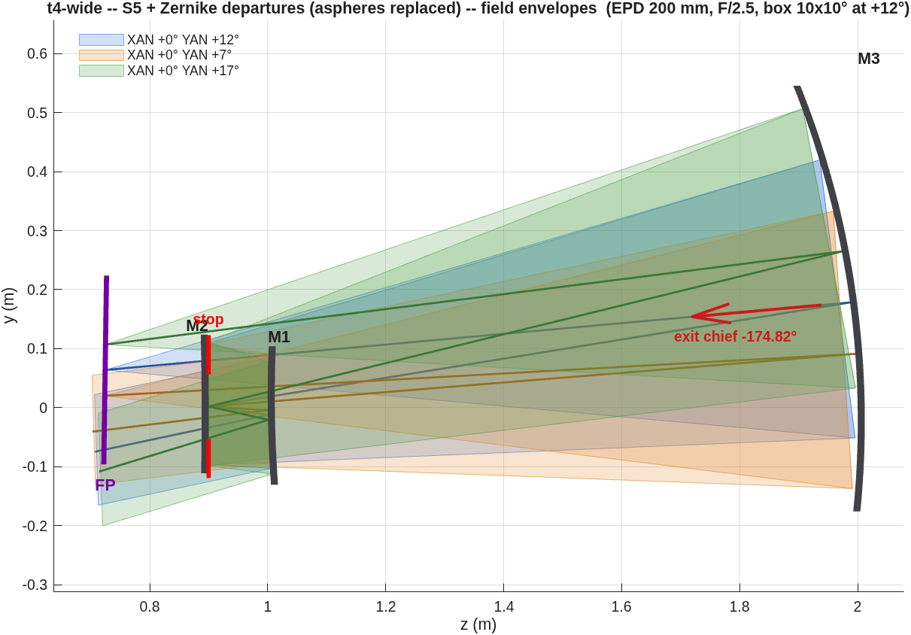{h=4.3}
~ Measure: design/src/oi_clear (signed, piercing-exact, ray-paired; reference floors gated).  Full defect record: PACKET.md, 2026-08-21 addendum SSA.

## B6 — Scoring and gates | Solve set != scoring set; gates carry a knee; two glass models
::: left
- Every reported number is the dense 11x11 map MAXIMUM under the cover's metric contract — the statistic the source study's own slides quote (decoded and gated on A2).
- oi_gates: exit pin PASS at ≤ tolerance; clearance PASS at ≥ min(spec) − 1.5 mm (the hinge knee); WARN below the larger spec value.
- Two glass models, one knob (P.clear_footprint): 'disk' (footprint centre + 1.15x radius — the model of record) and 'hull' (1.15-scaled convex hull — tighter on elongated off-axis patches).  The S4 design of record reads 34.1 mm under disk (confirmed at fine sampling) and 42.0 mm under hull.
- The solve must pay what the gate measures: hinge rows and report gates share the model and the knob.
::: right
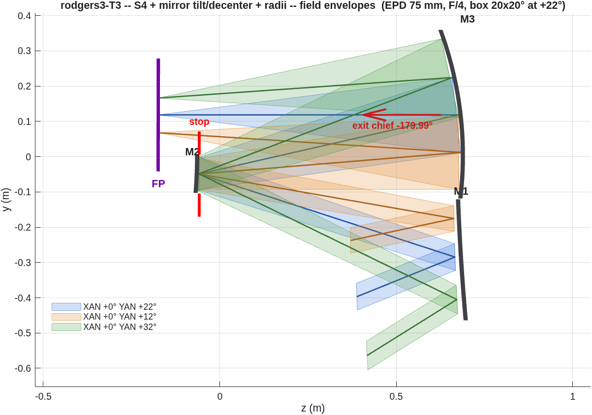{h=3.9}
~ strict RMS WFE, centroid reference on the stage's frozen focal plane, exit-pupil anchor, piston-only removal; quoted statistic = dense 11x11 map MAXIMUM over the field box.

## C7 — S1, the on-axis anchor | 37.8 nm over the on-axis box (reported rung 1: 159)
::: left
- What is varied: conics + aspheres (radii through the EFL/Petzval closure).  What is held: packaging (from the .seq truth), the on-axis box.
- The solve runs 4x deeper than the source rung — depth that S2 will tax (next slide).
- Walk: oi_story(...) stage 1, or run_t3() for the challenge instance verbatim.
::: right
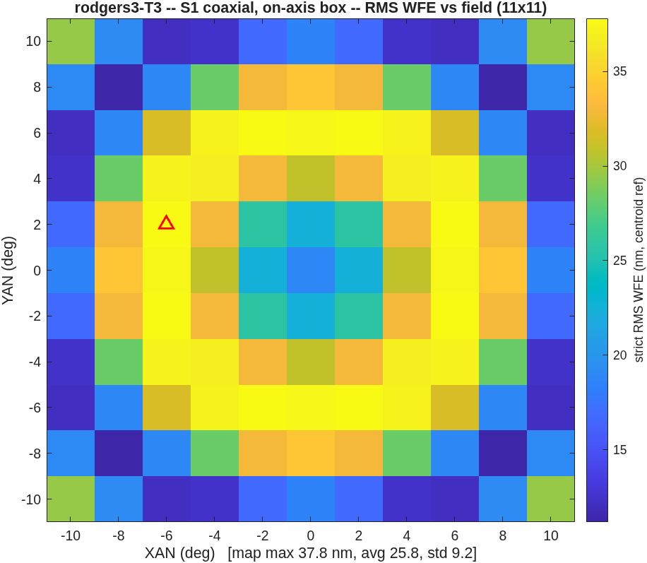{h=3.7}
~ strict RMS WFE, centroid reference on the stage's frozen focal plane, exit-pupil anchor, piston-only removal; quoted statistic = dense 11x11 map MAXIMUM over the field box.  S1–S3 are unconstrained; clearance floors are reported for context only.

## C8 — S2, the disaster is the pedagogy | 303,586 nm when the box moves 22° with the design frozen
::: left
- Only the focal plane may follow (tilt/focus refit).  The cost: 37.8 -> 303,586 nm — 34x the reported 8810, because the deeper on-axis optimum pays proportionally more off axis.
- The rung measures the S1 DESIGN as much as the offset: harder-tuned aspheres fall harder.  Expect your own S2 to scale with your S1 depth, not with the reported value.
::: right
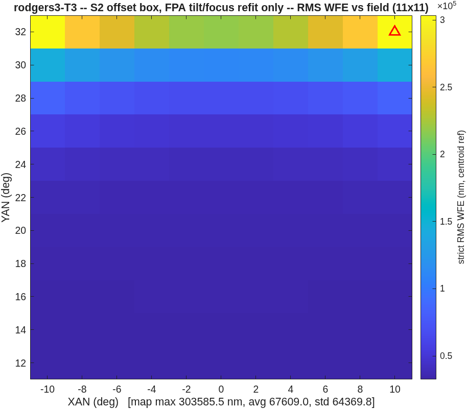{h=3.7}
~ strict RMS WFE, centroid reference on the stage's frozen focal plane, exit-pupil anchor, piston-only removal; quoted statistic = dense 11x11 map MAXIMUM over the field box.

## C9 — S3, re-solve at the used field | 252.0 nm (reported: 168) — from the better of TWO starts
::: left
- The two-candidate start is load-bearing: at a large offset the on-axis-optimized aspheres are poison (25.6 µm for the fresh Petzval-flat spheres vs far worse for the carry), but at a MILD offset the carry wins — score both at the used field, start from the winner.
- Conic migration under the bias doctrine (solve at the used field): K1 -2.42 -> 1.44 (oblate class).  Expect sign flips; they are the doctrine working, not an error.
- The stop pose is constructed ONCE at stage entry and frozen; from here the stop decenter is a solve variable driven by the exit row.
::: right
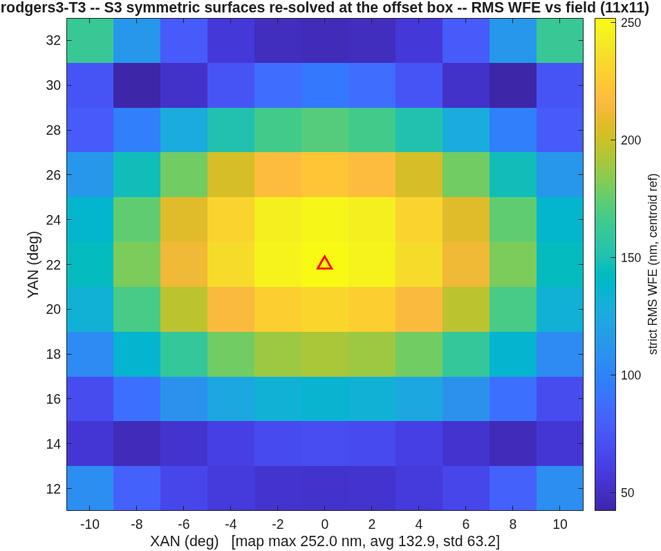{h=3.7}
~ strict RMS WFE, centroid reference on the stage's frozen focal plane, exit-pupil anchor, piston-only removal; quoted statistic = dense 11x11 map MAXIMUM over the field box.

## C10 — S4, buildability | 113.6 nm at a 34.1 mm floor (confirmed) vs the reported 117 at ≥ 35 — 0.97x
::: left
- Unconstrained, tilt/decenter reach 58.3 nm — with the M3-to-FP beam through M2's patch.  Not buildable; the map alone cannot tell you.
- With the clearance rows paying the nine-pair model: 113.6 nm at 34.1 mm (42.0 mm under the hull model).  Two toolchains, same constraint, same answer to 3% — and the constraint's measured price is 1.9x in WFE.
- Exit chief within 0.03° of horizontal at every stage (the equality row, not a wall).
::: right
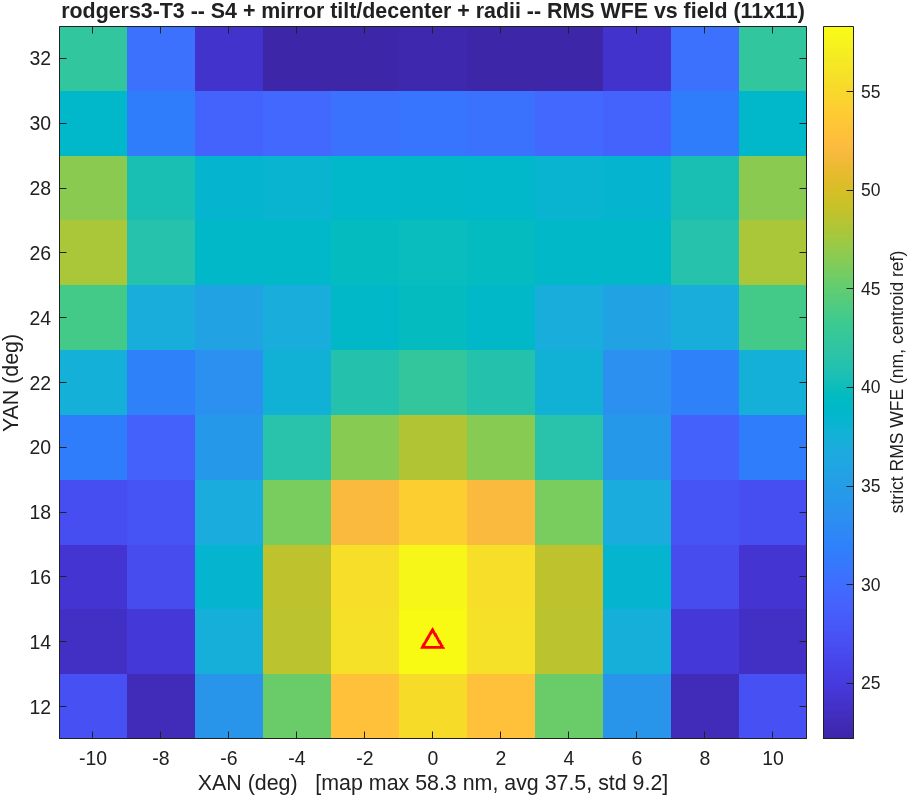{h=3.7}
~ strict RMS WFE, centroid reference on the stage's frozen focal plane, exit-pupil anchor, piston-only removal; quoted statistic = dense 11x11 map MAXIMUM over the field box.  The floor is fine-sampling-CONFIRMED under the fixed measure (addendum SSA).

## C11 — S5, diagnosed then beaten | The gap to the reported 53 was the solve-field count; matching it lands 45.4 nm
::: left
- The five-stage run closes at 118.2 nm — stalled at its S4 level, 83 variables against 9 solve fields.
- The controlled probes, all from the identical S4 seed (the printed start reproduces the record's 2150.1 nm — your re-walk should too):

| probe | fields | iters | map max | true floor |
| S5 of record | 9 | 30 (cap) | 118.2 | 30.0 mm |
| A | 9 | 150 | 110.7 | 28.9 mm |
| B | 25 | 60 | 54.1 | 28.2 mm |
| C (honest rows) | 25 | 49 (plateau) | 45.4 | 33.4 mm |
- Iterations are not the gap (A); fields are (B); with the fixed clearance rows the template lands 45.4 nm — 0.86x the reported 53 — at a floor 1.6 mm shy of the stated 35 (the rows bought back what the blind measure had conceded).
::: right
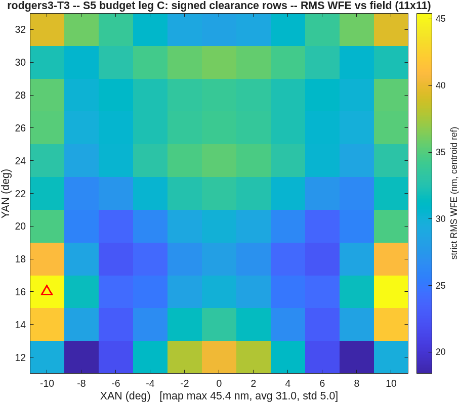{h=3.7}
~ strict RMS WFE, centroid reference on the stage's frozen focal plane, exit-pupil anchor, piston-only removal; quoted statistic = dense 11x11 map MAXIMUM over the field box.  The of-record S5 clearance (34.6 mm recorded) retracts to 30.0 mm under the fixed measure — addendum SSB carries the whole table.

## D12 — Counter-designs bound the space | Same constraints, same budget: the sphere+Zernike start wins; releasing the pins chokes
::: left
- (a) Sphere + Zernike from the start (no asphere heritage): 73.1 nm vs the heritage path's 118.2 — the heritage is a burden, not a head start.  The unconstrained variant (27.9 nm) did NOT survive buildability: always re-check a counter under the full constraint set.
- (b) Power + y-tilt released into the Zernike basis: 1372.9 nm — the freed modes fight the jobs the pins already do.  No evidence the reported 53 is term-set-limited; affirmative evidence for the pinning doctrine.
::: right
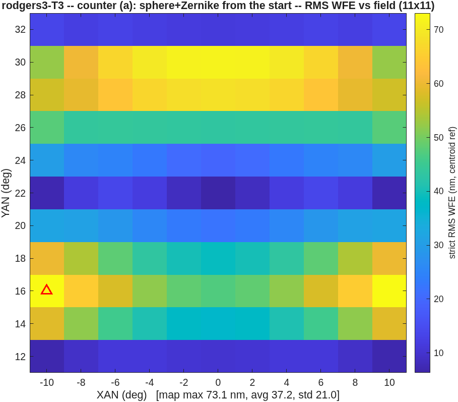{h=2.5}
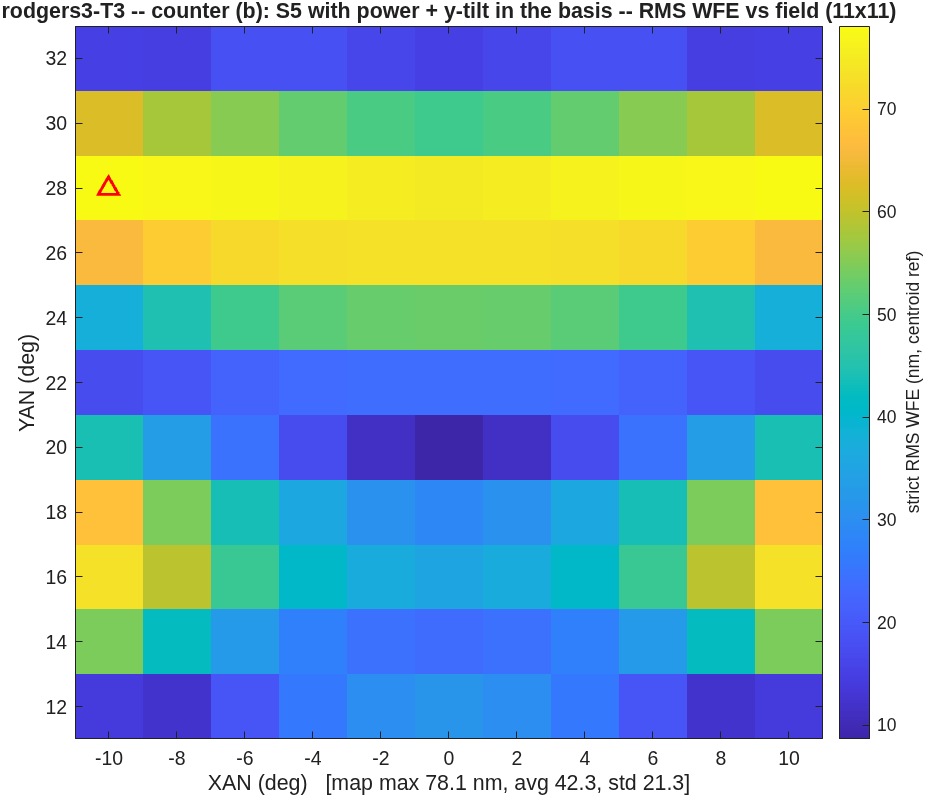{h=2.5}
~ strict RMS WFE, centroid reference on the stage's frozen focal plane, exit-pupil anchor, piston-only removal; quoted statistic = dense 11x11 map MAXIMUM over the field box.

## D13 — The gate map | Every claim in this deck lives in a committed test
::: full
| claim | where it is gated | the gate |
| the five-rung reproduction | tests/tRodgers3.m | per-rung bands around [0.8, 1.25]x (coarsened 5x5 maps) |
| the Zernike-basis decode | tRodgers3 negative control | C-offset dropped must miss by > 100x (measured 2989x) |
| the clearance measure | oi_clear reference floors | S4 34.11 / S5 29.97 mm reproduce exactly post-change |
| the template flow | tests/tOffsetImager.m | structural smoke: S1-S3 run and recover at reduced knobs |
| the promotion/graphics layer | freeform suite group | 128 pass / 0 fail on the merged tree (2026-08-21) |
- The suite is the arbiter of "reproduced": if your re-walk passes the freeform group, you have the solution.  If a number drifts outside a band, the gate names the rung and the convention to re-check.
~ Run: ./run_mmacos_tests.sh freeform (mmacos root).

## E14 — The re-walk, verbatim | Four commands, their runtimes, and what "reproduced" means
::: left
```
run mmacos_setup.m
rodgers3();        % Stage-0 gate ladder      (~40 min)
run_t3();          % template at the challenge
                   %   + counters             (~4 h)
run_s5_budget();   % probes A + B             (~8 h)
run_s5_signed();   % probe C, honest rows     (~4 h)
./run_mmacos_tests.sh freeform   % the arbiter (~1 h)
```
::: right
- Artifacts land beside the runners: challenges/rodgers3/t3/ (decks, figures, REPORT), s5_budget/ (probe maps + .mat), and the packet quotes all of it.
- "Reproduced" means: the five rungs inside their tRodgers3 bands; the probe-C start printing ~2150.1 nm (the seed self-check); the clearance reference floors to 0.01 mm; the suite green.  Map maxima are digit-stable on one engine build; across compilers expect round-off-level drift only.
- Every figure in this deck regenerates from the committed .mats without re-solving (the deck generators parse the records — nothing is hand-typed).
~ strict RMS WFE, centroid reference on the stage's frozen focal plane, exit-pupil anchor, piston-only removal; quoted statistic = dense 11x11 map MAXIMUM over the field box.

## F15 — Can a new user re-instance it without an agent? | Measured: FAIL — three attempts, three crashes, none past stage 2 of 5
::: left
- The protocol: an agent restricted to the COMMITTED docs (README, packet + addendum, function help) — no lore, no memory, no fixes — plays the new-user proxy at a fresh instance (EPD 150 mm, F/3.3, 15°x15° at 22.5°, clearances > 40 / > 25 mm, exit horizontal), envelope and seed left to the docs.

| attempt | envelope | reached | died in |
| 1 | 2× rodgers3 (EPD ratio) | S1 (20.9 nm) | oi_map_fig:43 |
| 2 | 1.65× rodgers3 (EFL ratio, the rescale the docs name) | S1 (30.6 nm) | oi_layout_fig:140 |
| 3 | as attempt 2, `stages=[1 3 4 5]` (documented S2 skip) | S1 (30.6 nm) | oi_map_fig:43 |
- One optical root cause, in the packet's own words: the S1 solve runs far deeper than the source rung (20.9 / 30.6 nm vs the reported 159), and "the S2 rung measures the S1 design as much as the offset" — taken past the point where the offset box traces at all.  The docs NAME the mechanism and offer no guard, cap, or knob.
::: right
- The frictions to act on first (of 15, all in the committed report):
- F7 — a dense-map headline can be computed from ONE surviving field point, with no warning: attempt 2's S2 printed [max 768194.5, avg 768194.5, std 0.0] — one finite point of 121; the failed fraction is never reported.
- F8 — the flow proceeds from a design it has already scored as unusable: one check there converts three opaque crashes into one accurate sentence.
- F1/F2 — the README's own run recipe errors on the path, and oi_story is undocumented outside its help.
- F3/F4 — no documented way to choose the envelope, and seed_R1_m is load-bearing with nothing saying so.
- F13 — the addendum's 25-solve-field lesson never reached the nsolve default or its help.
- What WORKED: the constraint conventions were guessable and the gates confirmed the guesses; the packet's t4 retraction kept the user out of the retired trap without opening it.
~ Instrument: BRIEF_oi_unguided; deliverable: challenges/rodgers3/t5_unguided_REPORT.md (verbatim, committed).  A negative result is a valid result — this one prices the gap between "documented" and "actionable".  Acts 2 and 3 — the fixes, then the walk — next slide.

## F16 — The sequel: fix the frictions, then walk the box | The walk lands 69.8 nm (8531x better); the endgame re-solve then closes the last gate at NEGATIVE cost — 47.1 nm at 30.9 mm
::: left
- Act 2 — the REDEMPTION rerun (run_t5r): the same instance on the fixed template (S1 depth cap, INVALID-map honesty, sentinel refusal, graceful ray loss).  ZERO crashes, and every failure now diagnoses itself in one line: the capped S1 lands 74.9 nm, S2 prints "INVALID — 104/121 fields lost every ray", the exit gate says "unmeasurable" instead of dying.  But S3–S5 stall at ~596 µm with the beam 205 mm INSIDE the glass: a cold start at the full 15° box is outside the convergent basin.  Robustness redeemed; convergence not — and both counter-designs stall at the same level, so it is the basin, not the freedom path.
- Act 3 — the WALK (oi_walk): solve an easy 5° box first (diffraction-limited, clears comfortably), then walk the box open toward the target, carrying each solved design as the next step's warm start.  Full freedom + all constraint rows at every step; every carried design is screened at the widened box before solving — it traced first try at every step: the basin moves smoothly with the box.
::: right
| step | box | map max (nm) | floor (mm) | gates |
| 1 | 5x5° | 10.9 | 98.0 | exit PASS / clear PASS |
| 2 | 8x8° | 21.5 | 67.4 | exit PASS / clear PASS |
| 3 | 11x11° | 27.3 | 25.1 | exit PASS / clear PASS |
| 4 | 13x13° | 40.0 | 24.6 | exit PASS / clear PASS |
| 5 | 15x15° | 69.8 | 17.8 | exit PASS / clear FAIL |
- Exit PASS at every step — and the last-step clearance residual (17.8 vs 25 mm) CLOSED post-walk: the truer hull model reads the committed design at 28.7 mm (clears as-is), and a restart re-solve in the SAME envelope lands 47.1 nm at a 30.9 mm floor — better than the walk on both axes.  The final step had stopped at 6 iterations on the WFE-only plateau break; clearance was never blocking, just under-solved.
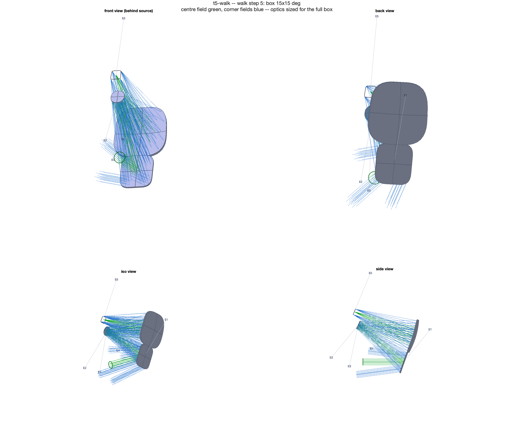{h=2.15}
~ Records: the t5_redemption / t5_walk / t5_endgame REPORTs (offset_imager template dir); runners oi_walk.m + run_t5_endgame.m.  Every number: the cover contract.

## F17 — Should mmacos embed an agent helper? | The F15/F16 arc feeds both camps — that is the question
::: left
- FOR, from this arc: every defect found was a CONCEPTUAL coupling — a frame convention, a metric reference, a constraint model — that documentation had not prevented; agent-in-the-loop found and fixed each in hours.  And F15's one conceptual failure (S1 depth poisoning offset traceability) was DOCUMENTED and still not actionable — the case for advice AT CALL TIME ("your S1 is 8x deeper than the reference; expect the offset box to lose rays").
- AGAINST, from the same arc: every fix COMPILED into a check — the prescription validator, the pose bound, the signed piercing measure, the gate map — and 13 of F15's 15 frictions compile the same way (guards, caps, doc lines; F8 is literally "one check converts three crashes into one sentence").  Compiled knowledge is inspectable, testable, maintenance-stable; a runtime assistant is none of those by default.
- The F16 sequel is itself an AGAINST exhibit: the continuation STRATEGY — agreed in one discussion — compiled into a runner (oi_walk.m), and the compiled walk then solved unattended the instance the cold start could not.  The walk itself is compiled knowledge.
::: right
- Where is the line between knowledge compiled into checks and knowledge served by an assistant?
- What should a helper catch AT CALL TIME that a validator cannot?
- Who maintains the helper's knowledge when the engine moves — and how is IT gated?
- Would you trust a design whose constraint model was chosen by the assistant?
~ Discussion slide: questions are the deliverable.  The measured input: docs + gates did NOT carry an unassisted user through a COLD re-instance (F15); the compiled walk then did (F16) — most of the gap was compilable, and was compiled.
