<!-- CTB coronagraph diffraction-model progress deck, v4 2026-08-25.
     Build: python3 make_brief_slides.py deck_ctb.md
     Sources: bench_ctb/CTB_PROP_STATUS.md (sessions 4-10) + committed
     committed figures in THIS directory (mask families + leg fix +
     export, pol-ifo ab494ec..a060ef0/46d0bc6; DM layer + EFC,
     dev-candidate ea64552).  Style: doc/DECK_STYLE.md +
     STYLE_REPORTS.md section 5 (gate run 2026-08-25: clean).       -->

# The Coronagraph Testbed Model
End-to-end diffraction on an all-reflective testbed — eight off-axis parabolas, two deformable mirrors — validated against PROPER
D. C. Redding with Claude Code — 25 August 2026. Model + drivers: MACOS_resources dev-candidate, mmacos/templates/30_instruments/bench_ctb (committed, with status record).
~ The diffraction layer, complete and validated: propagation prescriptions cross-checked against PROPER, dark-zone contrast with the standard mask families head-to-head, an off-axis companion, finite bandpass, a hand-off package an external PROPER user runs with no macos — and now the two deformable mirrors closing a wavefront-control loop on the model itself, digging the dark zone 36× below the static coronagraph.

## 1 — The bench and the model | Two prescriptions, one physical train; every mask plane bracketed by its own exit-pupil reference sphere
::: left
- The bench: 8 off-axis parabolas, 2 deformable mirrors (DM1 is the aperture stop), apodizer and Lyot at pupil images, focal-plane mask and field stop at focus images, camera (FPA) at the final focus. Geometrically diffraction-limited (0.0014 λ).
- Two propagation prescriptions share the physical optics: a compact model (31 elements — one plane-to-plane leg DM1→DM2, a four-surface mask block at each focus, far-field to the FPA) and a full surface-to-surface model (44 elements — every inter-optic leg propagated).
- The four-surface mask block does the work: flat return at the mask plane, exit-pupil sphere carrying the first half-propagation, the mask plane carrying the second half, and the same sphere again — both sphere distances identical to all digits, which is exactly the condition that makes the block transparent when no mask is applied.
- Both prescriptions load pre-aligned and produce a centered point image; chief-ray intersections match the geometric bench to 10⁻¹³ at every optic.
::: right
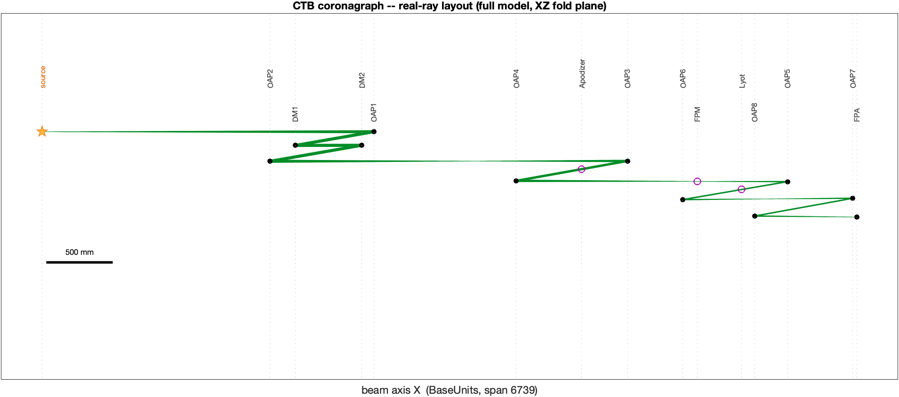{h=3.1}
~ Masks (apodizer, focal-plane mask, Lyot, field stop) are applied in MATLAB by multiplying the propagated complex field at the passive mask planes — the prescription carries the propagation, the script carries the masks.

## 2 — Validation | The new propagation step reproduces PROPER exactly; the two models differ only where their fidelity differs
::: left
- The one propagation step this chain rests on that the earlier PROPER campaign never tested — the through-focus half-propagation from the exit-pupil sphere to the mask plane — was cross-checked against MATLAB PROPER at matched sampling: focal-plane pixel pitch ratio 1.0000, peak-normalized correlation 1.000000, centroid offset 0.000 px.
- The half-propagation pair round-trips to machine precision when no mask is applied (the sphere-distance identity), and the focal-grid pitch the engine reports now matches the deterministic value λR/(N·dx) to ratio 1.0000 — an earlier inconsistent pitch reading traced to the superseded block construction, not the engine.
- A wrong number found and fixed: the compact prescription's DM1→DM2 leg propagated 400 mm where the mirror spacing is 500 mm, with its end plane on the wrong side of DM1. The prescription generator flagged it; two independent fixes (lifting the full model's values) agree to every digit. Every figure and number here is from the corrected prescription.
- Compact vs full: bare point images agree to 0.9989 correlation with encircled energy within 0.3% (unchanged by the fix); with the coronagraph in, the suppression gap narrowed from 2.6× to 1.76× — the remaining gap is the mirror-to-mirror diffraction the compact model omits. PROPER remains the arbiter for both.
::: right
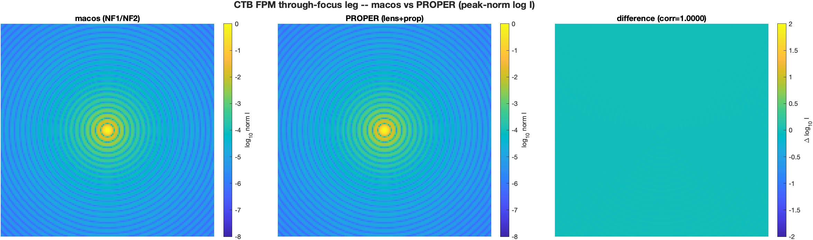{h=2.3}
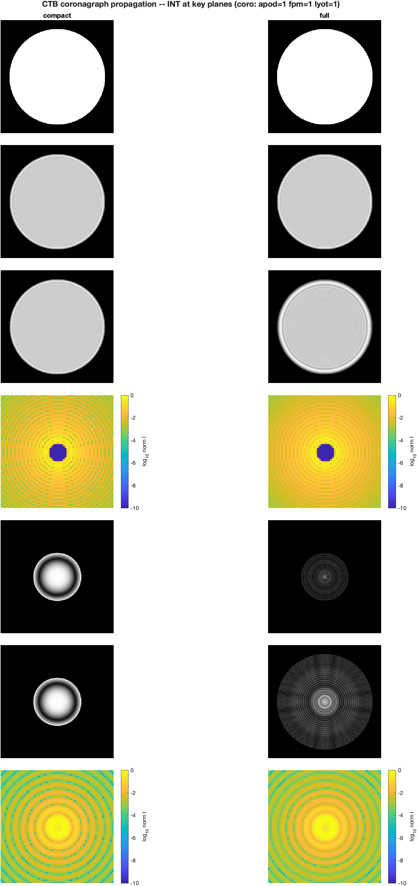{h=2.2}

## 3 — Coronagraph performance | A half-pixel centering fix, 4× finer sampling, and a mask sweep bought 16× in contrast
::: left
- Centering: the mask builders sat half a pixel off the propagation's focus pixel — every occulter leaked asymmetrically. Fixed (shared mask builders centered on the focus pixel); the vortex, most sensitive to a decentered core, gained the most.
- Sampling: the FPA grid moved from 2.0 to 4.0 px per λ/D (model size 1024; the pupil grid is unchanged — zero-padding only), resolving clean symmetric rings.
- Mask sweep over the ranges the literature uses (occulter 1–3 λ/D, Lyot 75–90%): pure contrast pushes to the sweep edges, so throughput is recorded beside contrast. A widened sweep found a robust interior null at occulter = 2.70 λ/D — a diffraction resonance of this bench, persisting at both samplings — with Lyot 0.50 as the shipped default (25% throughput; the Lyot radius sets the throughput).
- Net: dark-zone mean contrast 4.6×10⁻⁶ → 2.9×10⁻⁷ (~16×); suppressed FPA peak 1.9×10⁻⁵ → 1.4×10⁻⁶. Deeper suppression takes shaped masks: the families on slide 5 reach three decades further.
::: right
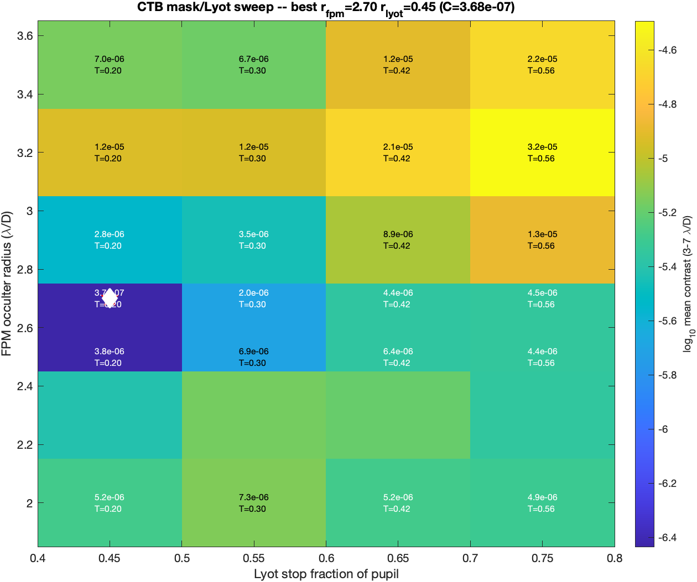{h=2.25}
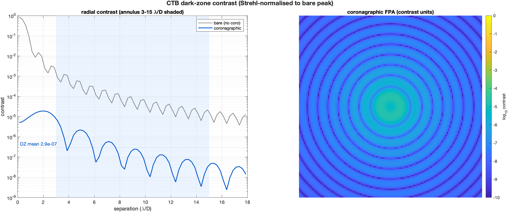{h=2.2}

## 4 — A planet in the dark zone, and a finite band | Each run surfaced a modeling rule now on record
::: left
- Companion injection: the focal-plane window method from the earlier coronagraph examples does not displace a companion here — the alignment rule that puts every vertex on the chief ray re-centers every grid on the tilted chief, landing the "planet" back under the occulter. The working method is a pupil phase ramp on the complex field at DM1: k cycles across the pupil puts the companion at exactly k λ/D against the fixed masks. Verified: 6 λ/D commanded, 5.98 measured; at flux ratio 10⁻³ the companion stands above the stellar residual and the difference panel recovers it cleanly.
- Finite bandpass: wavelengths summed incoherently — after resampling each wavelength's point image onto one common physical detector grid. The far-field step re-grids per wavelength, so a naive array sum silently cancels chromaticity (the first attempt measured exactly zero chromatic effect — a trap now documented). With an occulter of fixed physical size over a 10% band, the deep 2.70 λ/D null degrades 2.1× (deep-vs-broadband is a real trade); the variant whose mask scales with wavelength confirms the machinery itself adds no chromatic error.
::: right
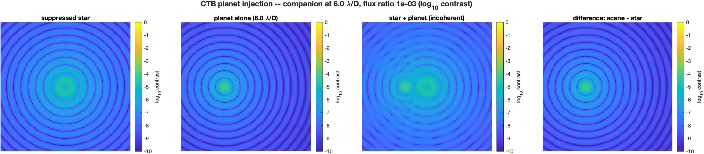{h=2.25}
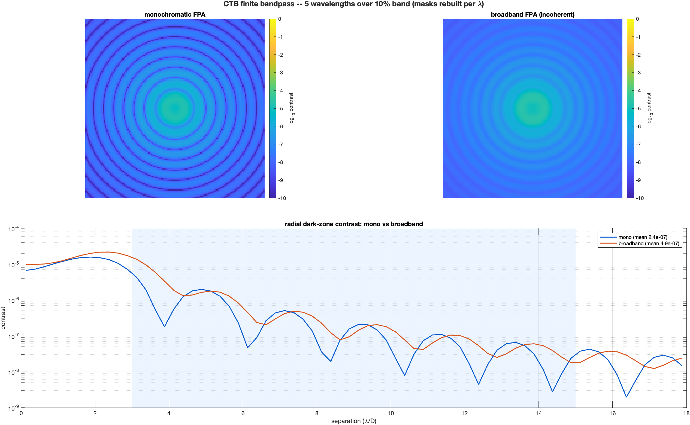{h=2.2}

## 5 — The standard mask families, head-to-head | Static masks, before any DM control: the apodized-pupil Lyot is deepest; the pixel-averaged vortex second, at three times its throughput
::: left
- Five mask families from the literature, built as reusable mask functions on the existing complex-mask interface — no engine work. Every formula was taken verbatim from the source paper — secondary summaries get them wrong (band-limited masks are 1−sinc in amplitude, not intensity; the Lyot trims by 1−ε, not 1−2ε; the Roddier π-mask uses no apodizer).
- All six score on one grid, one annulus (3–15 λ/D), one normalization — the hard occulter of slide 3 re-scored on this common footing. Every mask is generated at 8× sub-pixel resolution and binned to the model grid (area-average for amplitude, complex-average for phase).

| mask | static dark-zone mean | throughput |
| apodized-pupil Lyot (prolate) | 2.1×10⁻¹⁰ | 27% |
| vortex, matched Lyot | 1.4×10⁻⁸ | 81% |
| band-limited (4th order) | 2.7×10⁻⁸ | 36% |
| hard occulter | 2.5×10⁻⁷ | 25% |
| Roddier π-mask | 2.4×10⁻⁶ | 81% |
| dual-zone phase | 6.8×10⁻⁶ | 81% |
- The vortex row moved 21×: the direct-sampled mask's singular core — mis-phased pixels on the stellar image core, a sampling artifact, not vortex physics — had floored it at 2.9×10⁻⁷. Pixel-averaging cures it, and the Lyot becomes a real depth dial: charge 4 reaches 6.6×10⁻¹¹ at a 0.50 stop — apodized-pupil-Lyot class at the same 25% throughput. Full diagnosis in backup.
::: right
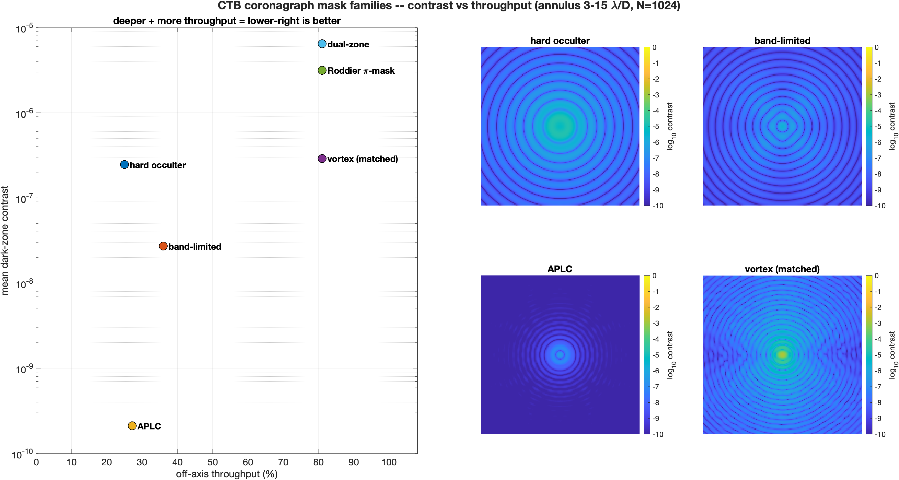{h=3.0}
- Everything above is the mask alone. With the two deformable mirrors closed-loop (slides 9–11, control at N=512), the floors drop by decades:

| controlled chain | static | closed-loop floor |
| hard occulter, Lyot 0.50 (mono) | 2.9×10⁻⁷ | 3.8×10⁻⁹ |
| vortex charge 4, Lyot 0.60 (mono) | 1.7×10⁻⁸ | 6.8×10⁻¹⁵ |
| vortex charge 4, Lyot 0.60 (10% band, unpol.) | 2.2×10⁻⁸ | 2.0×10⁻¹¹ |
~ The hybrid Lyot coronagraph is deferred to the FALCO integration: its focal-plane mask is a product of the design loop, not a formula. Throughput = Lyot open area times apodizer transmission — an off-axis proxy, not an end-to-end planet throughput.

## 6 — The vortex against the Lyot stop | Charge 4 under-runs every fixed design at every throughput: 8.8×10⁻¹¹ at the band-limited mask's own 36%
::: left
- One mask, one dial: the vortex phase mask is fixed; only the Lyot stop fraction moves. Every point shares the head-to-head's grid, annulus (3–15 λ/D), and normalization, and the fixed-design markers are read from the committed comparison — the same footing, no re-scoring.
- The trade the cured core revealed: the starlight the vortex rejects piles just outside the geometric pupil edge, so contrast rises steeply as the stop opens toward it — a genuine depth-for-throughput dial where each fixed design is a single point. Charge 4 runs about 4× deeper than charge 6 at every stop (the smaller pixel-averaged core).
- Readings from the curve: at the apodized-pupil Lyot's operating point, charge 4 with a 0.60 stop is deeper (8.8×10⁻¹¹ vs 2.1×10⁻¹⁰) at more throughput (36% vs 27%) — with no apodizer to fabricate. At the band-limited mask's 36% it is 300× deeper; at 81% throughput it holds 8.0×10⁻⁹, thirty times below the hard occulter's contrast at three times its throughput.
- The steep rise past 0.90 is the leak ring arriving inside the stop (flux inside grows 0.1% → 1%); the useful range of the dial is 0.50–0.90.
::: right
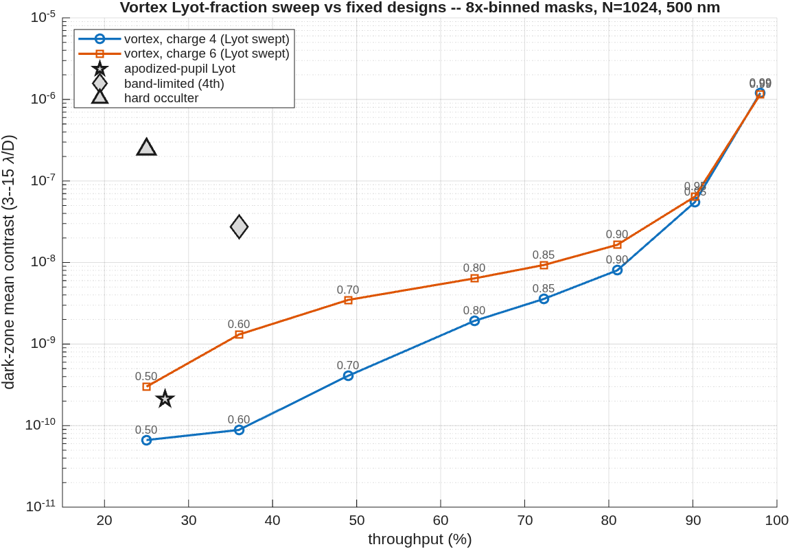{h=3.45}

## 7 — Phase-factor export | External PROPER models can consume this model's planes, and check theirs against ours station by station
::: left
- One self-describing file carries the full 44-element model: 18 stations (complex field, amplitude, OPD, grid pitch, all in metres), the 17 propagation legs, the 4 reference spheres, and 18 per-plane phase screens — with the sign, orientation, and centering conventions stamped inside. The orientation is measured, not asserted: a +X pupil phase ramp lands the image peak where the file says it will.
- A companion PROPER run script reads only the exported file — no macos — and replays the model two ways: every leg propagated, or handing off at the exported fields. Focus stations reproduce at correlation 1.000000 in both modes; gated pupil planes ≥ 0.9998 replayed, ≥ 0.96 handed off.
- Rule 1, replaying a focus: start the PROPER propagation from the exported converging-sphere plane, not from the mirror before it. The focal-plane pixel size is set by the sphere's radius; starting at the mirror gives pixels 4.5× the wrong size, and nothing overlays.
- Rule 2, comparing between mirrors: compare intensities, not phase maps. The two codes measure phase from different baselines (this model from a flat plane, PROPER from its internal reference beam), so identical beams still show mismatched phase. Simplest: start each PROPER stage from the exported field at that plane — that agrees by construction.
::: right
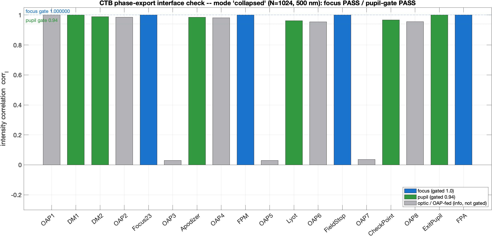{h=3.1}
~ Export ≈320 MB, kept out of git: the committed truth is an 87 KB fingerprint plus a 3 MB downsampled preview, with one-command regeneration. Single wavelength; the exported OPD is wrapped (the complex field is the primary carrier). Per-wavelength export composes with the bandpass machinery when needed.

## 8 — External hand-off: a pure-PROPER run | From the exported data alone, PROPER reproduces the bare image exactly and forms the same dark zone
::: left
- The package is three files: the exported model (fields, legs, spheres, per-plane screens, mask arrays, all conventions stamped inside), a per-plane check script, and a run script that reads only the export plus PROPER — no macos anywhere. It asserts the orientation probe before trusting any comparison.
- A finding that shapes any external reconstruction: one single continuous PROPER beam cannot reproduce this model (focal pitch ratio 0.71, correlation 0.005). The model samples every intermediate focus at the system exit-pupil Fraunhofer pitch — set by the exit-pupil sphere radii, not by each parabola's own focal length — and one grid cannot carry both the pupil pitch and that focal pitch across a focus-to-focus relay. The shipped form is one pure-PROPER script seeded from the exported fields.
- Bare image: focal pixel pitch ratio 1.0000, intensity correlation 1.000000 — the exported and PROPER images are identical.
- Coronagraph: the PROPER cascade reaches dark-zone mean 1.4×10⁻⁸ over 3–15 λ/D. The check is one-sided by design: the idealized relay seeded at the apodizer carries the upstream aberration but omits the downstream real-mirror figure that scatters light in the full model, so it runs legitimately deeper than the shipped 2.9×10⁻⁷; the bound that matters is that it lands within 2× above the shipped value.
::: right
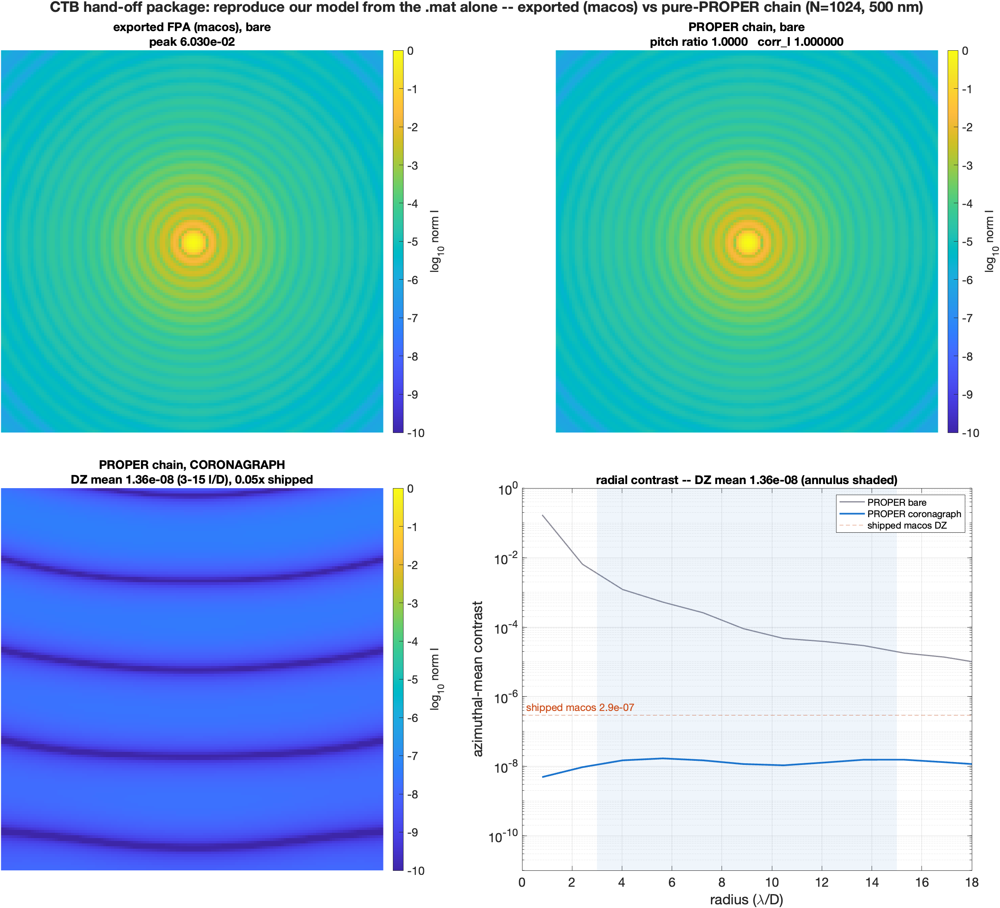{h=3.35}

## 9 — The deformable mirrors close the loop | Electric-field conjugation on the model itself: dark-zone mean 2.9×10⁻⁷ → 8.1×10⁻⁹ (36×) at 10 nm strokes
::: left
- The DMs become controllable surfaces: each carries a 256-point displacement grid in its own element frame, driven by a 32×32 actuator lattice through Gaussian influence functions (12% nearest-neighbor coupling, 0.67 mm pitch = beam/32; 880 actuators of each DM sit inside the beam).
- The control matrix is measured, not modeled: every actuator is poked 2 nm and propagated through the full masked chain — 1760 pokes, 11 minutes — so the correction solve has no model error to exploit. Each iteration re-propagates the model, scores the measured contrast, picks the regularization by that measurement, and stops itself when no step improves.
::: right
- Result: 2.9×10⁻⁷ → 8.1×10⁻⁹ (36×) in 19 iterations at 9.9/8.6 nm rms surface stroke. The best any linear solve of the measured matrix can reach is 4.5×10⁻⁹ at 11 nm — the loop lands within 2× of that with a matrix measured once at the flat state; re-measuring it around the corrected state is the next depth increment. Restricted to DM1 alone, the same loop stalls at 1.3×10⁻⁷ (2.3×): the pupil mirror is phase-only control, and the full annulus also needs the amplitude lever the out-of-pupil DM2 supplies.
- Where the correction works hardest: with the 50% Lyot stop, 32 actuators steer light cleanly to about 8 λ/D on the final image scale — the inner half of the zone deepens 40×, the outer 25×, and the largest strokes ring the Lyot edge image on the mirror.
::: full
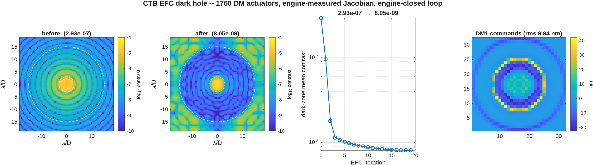{h=2.1}
~ Sensing is assumed perfect — the loop reads the model's complex field directly. Estimating that field from camera images alone (pairwise probing, as a testbed must) is the next layer of realism.

## 10 — Deeper: the loop on the vortex chain | 1.7×10⁻⁸ → 6.8×10⁻¹⁵ at half-nanometer strokes — this chain leaves nothing the mirrors cannot remove
::: left
- The same loop pointed at the slide-6 configuration: charge-4 vortex, Lyot 0.60, no apodizer. Control runs at N=512, where this chain's static floor is 1.7×10⁻⁸ (the slide-6 sweep is N=1024 — the pixel-averaged core covers more of the λ/D scale at coarser sampling).
- The first iteration removes 300×, and commands never exceed ~0.5 nm rms: the residual field is so small that the measured control matrix is nearly exact, and the solve lands where it points.
- Going deeper is one re-measurement: rebuild the control matrix about the corrected state (7 minutes of pokes) and continue. The hard-occulter chain gains 2.1× to 3.8×10⁻⁹ and converges — consistent with its linear bound of 4.5×10⁻⁹ — while the vortex chain gains another 86× to 6.8×10⁻¹⁵.
- The reading: the hard occulter's floor is physics — occulter-edge diffraction the mirrors cannot represent. The vortex chain's floor is arithmetic — the residual field is ~3×10⁻⁸ of the peak amplitude, the roundoff of double-precision propagation. A real bench stops far earlier, at sensing noise and drift; those are the next layers of realism.
::: right
| chain | static | fixed matrix | re-measured |
| hard occulter, Lyot 0.50 | 2.9×10⁻⁷ | 8.1×10⁻⁹ | 3.8×10⁻⁹ |
| vortex charge 4, Lyot 0.60 | 1.7×10⁻⁸ | 5.8×10⁻¹³ | 6.8×10⁻¹⁵ |
- Strokes at the floor: 9.9/8.6 nm rms (hard chain), 0.49/0.55 nm rms (vortex chain, before/after re-measurement). Dark zone 3–15 λ/D, both chains, same annulus and normalization throughout.
::: full
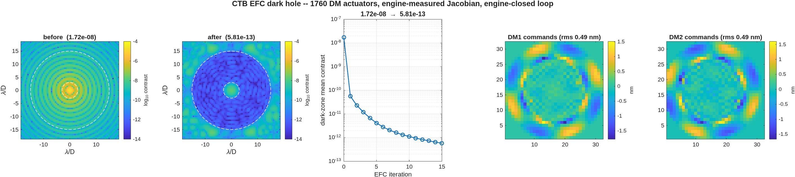{h=2.0}

## 11 — The physics layers: band and polarization | The 10% band floors the loop at 2×10⁻¹¹; coating polarization at these angles contributes 10⁻¹⁵ — chromaticity owns the floor
::: left
- The models: per-wavelength propagation at 0.95/1.00/1.05 λ₀ (the vortex mask is a pure angle map, so nothing rebuilds; the target is the fixed physical annulus), and polarization as the coated train's ray-traced Jones pupil — a quarter-wave magnesium-fluoride overcoat on aluminum, all ten mirrors — applied as per-component pupil screens: each of the four Jones components propagates as its own scalar chain, unpolarized input is their half-weighted sum. One control matrix per wavelength drives the co-polarized mean; the component spread about that mean is the measured, uncontrollable polarization part.
- The floors (charge 4, Lyot 0.60): polarization alone reaches 5.8×10⁻¹³ — indistinguishable from the scalar loop — with the uncontrollable part at 1.1×10⁻¹⁵. The 10% band alone floors at 1.9×10⁻¹¹; together 2.9×10⁻¹¹, and re-measuring the matrix about the corrected state gains only 1.5× more — a converged, genuinely chromatic floor: one mirror setting cannot null three wavelengths.
::: right
- Rebalancing the Lyot under full physics: the stop can open for throughput — 0.70 holds 6.5×10⁻¹¹ at 49%, 0.80 holds 1.2×10⁻¹⁰ at 64% — every operating point decades below the hard-occulter chain's mono floor.
- A measurement lesson, recorded with the drivers: the Jones screens must be normalized by the COMPLEX mean of their co-polarized element. Magnitude-only normalization leaves the coatings' global reflection phase in the screens; the loop's corrections then land rotated by twice that phase and add energy (measured: achieved-vs-predicted correlation −0.80). The global phase is common piston — removing it is exact for contrast.
- What polarization does NOT do here is the finding: at this bench's gentle incidence angles, protected-aluminum coating polarization is a 10⁻¹⁵-class effect — which is exactly why coronagraph testbeds are folded gently.
::: full
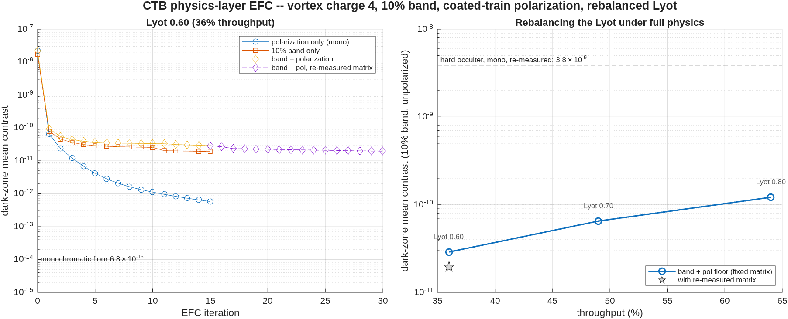{h=2.75}

## 12 — Next | Toward a real coronagraph model, in dependency order
::: full
- Realistic sensing. The loop reads the model's complex field directly; a testbed estimates it from camera images (pairwise probing). That estimator is the remaining step between these floors and lab-representative ones — and FALCO, the community's standard wavefront-control software, can then drive the same DMs (the hybrid Lyot mask enters there, since its design comes from that control loop).
- Aberrations and drifts. As-built mirror surface maps (measured-quality power spectra), then alignment drifts as a time series against the delivered control loop — dark-zone maintenance, and how long the hole survives between corrections.
- Validation against testbed data — the capstone. Needs a named dataset from a real bench and the measured (not design) parameters that produced it.
~ Mechanical layer delivered and merged: a prescription generator that reproduces both hand-built models to round-off, regression tests pinning the validated numbers (two suites, 16 checks green), the example README, and the exit-pupil-finder guard in the engine (pushed).

## 13 — References | Sources for the mask families and the control method; every formula taken from the paper itself
::: full
- Band-limited masks: Kuchner & Traub 2002, ApJ 570, 900 (4th order); Kuchner, Crepp & Ge 2005, ApJ 628, 466 (8th order).
- Apodized-pupil Lyot: Soummer 2005, ApJ 618, L161 (the prolate apodizer); Soummer et al. 2011, ApJ 729, 144 (the GPI instrument configuration used here).
- Phase masks: Roddier & Roddier 1997, PASP 109, 815 (the π-spot); N'Diaye et al. 2012, A&A 538, A55 (the achromatic dual-zone); Soummer, Dohlen & Aime 2003, A&A 403, 369.
- Vortex: Mawet et al. 2005, ApJ 633, 1191; Foo, Palacios & Swartzlander 2005, Opt. Lett. 30, 3308; Jenkins 2008, MNRAS 384, 515 (the even-charge rejection property).
- Wavefront control: Give'on et al. 2007, Proc. SPIE 6691 (electric-field conjugation, the correction solve of slide 9).
- Diffraction reference code: PROPER — Krist 2007, Proc. SPIE 6675 (the arbiter for every propagation cross-check in this deck).
~ A companion three-slide deck (ctb_mask_families, committed beside the drivers) carries the code map: which script builds which mask, and the parameters a user can change.

## Backup Slides |
::: full
- Galleries, per-family detail, the per-leg replay check, and the control-loop diagnostics.

## The mask families, one by one (1 of 2) | Apodized-pupil Lyot and band-limited
::: left
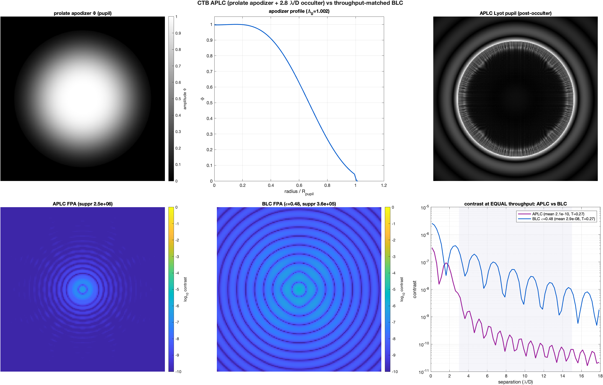{h=3.1}
::: right
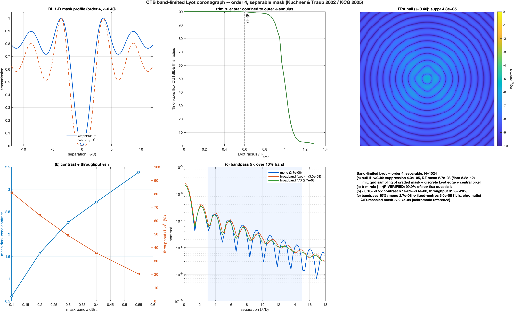{h=3.1}

## The mask families, one by one (2 of 2) | Phase masks and the vortex
::: left
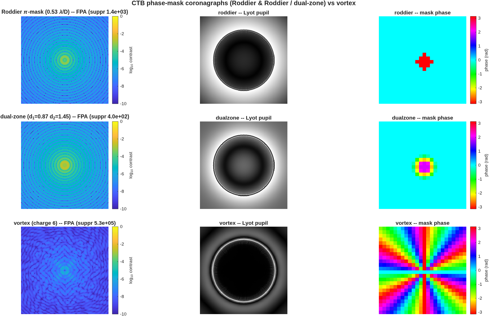{h=3.1}
::: right
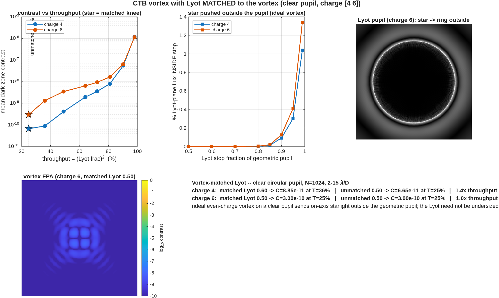{h=3.1}

## The vortex core: sampling set the floor | An ideal-pupil probe with no bench reproduces the shipped 2.9×10⁻⁷ — and pixel-averaging removes it
::: left
- The probe: the same sampled charge-6 vortex in a pure Fourier chain on an ideal clear pupil (N=1024, 4 px per λ/D, Lyot 0.90) — no bench optics anywhere. Direct-sampled: 3.0×10⁻⁷, matching the shipped bench number. Supersampling the pupil edge changes nothing. The floor is the mask's own singular core: near the axis the phase wraps faster than the grid, and those mis-phased pixels sit exactly on the stellar image peak, scattering ~0.2% of the starlight back inside the Lyot.
- Generate-at-K× and complex-bin cancels the core phasors (transmission 0 at the core pixel, a smooth ~1-px taper): 4× gives 3.4×10⁻⁹, 8× gives 3.0×10⁻⁹ (converged). An explicit 1 λ/D opaque core dot is worse (9.8×10⁻⁹ — its own edge diffracts). Charge 2 is the counterexample: the medicine is for even charge ≥ 4.
- On the bench (8×-binned, charge 6, Lyot 0.90): 1.4×10⁻⁸ — the remaining gap to the ideal-pupil 3.0×10⁻⁹ is the bench's own residual, no longer the mask.
::: right
- With the core fixed, flux inside the stop is 0.0–0.1% out to a 0.90 fraction — the analytic "all starlight outside the pupil" property, visible at last — and the Lyot fraction becomes a genuine depth-for-throughput trade (it used to look free because every fraction hit the same artifact floor):

| Lyot fraction | charge 4 | charge 6 | throughput |
| 0.50 | 6.6×10⁻¹¹ | 3.0×10⁻¹⁰ | 25% |
| 0.80 | 1.9×10⁻⁹ | 6.4×10⁻⁹ | 64% |
| 0.90 | 8.0×10⁻⁹ | 1.6×10⁻⁸ | 81% |
- Charge 4 at a 0.80 stop dominates the band-limited mask in both depth and throughput; at 0.50 it reaches the apodized-pupil Lyot's class.

## Bare-optics agreement, and the bench | The two prescriptions before any mask, and the geometric layout they share
::: left
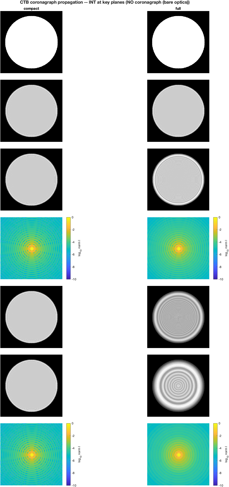{h=3.3}
::: right
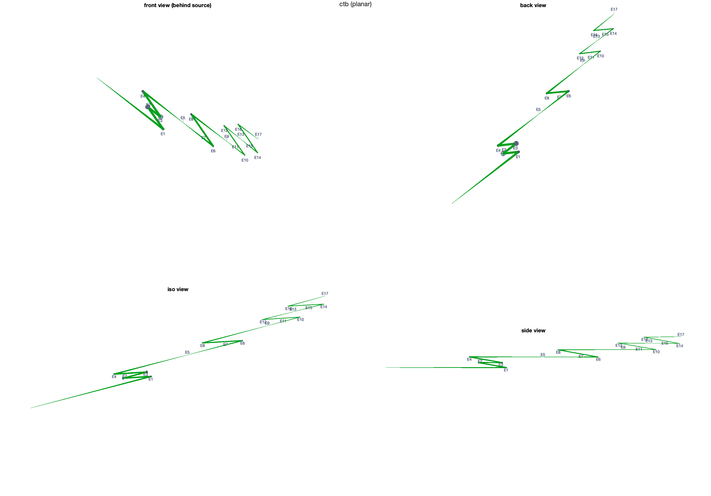{h=3.0}

## Per-leg replay check | Every station reproduced when each leg starts from the exported field
::: full
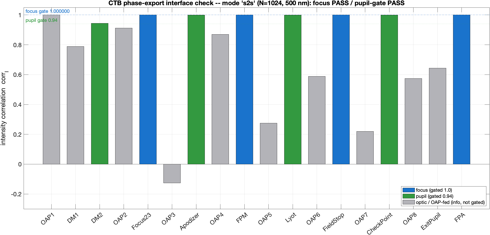{h=3.4}

## Control-loop diagnostics | Two silent failure modes, found and pinned by regression tests
::: full
- Commands are real numbers. The correction solve must treat the real and imaginary parts of the field as separate equations; a complex-valued solve returns complex commands whose imaginary half the MATLAB-to-engine interface silently discards. The symptom is quiet: the loop still improves, but crawls at 3% per iteration with the achieved field nearly uncorrelated with the prediction (correlation 0.13). Solved in the split form, the same loop digs 16× in two iterations. The DM model now rejects complex commands outright.
- Pupil wavefront maps must be read at the exit pupil. Read at the camera (the default), a DM bump smears into a smooth error ten times its physical size — it looks exactly like a surface-amplitude bug in the model and is not. At the exit pupil the response is 2·cos(incidence) times the commanded surface within 2%, at the commanded position to a pixel, with mirror symmetry exact.
- The validation ladder under the loop, all pinned by the regression suite: commanded surface read back bit-exact; two-poke superposition to 1 part in 10¹²; the propagation chain bit-repeatable run to run; poke response step-size-independent to 5%.
